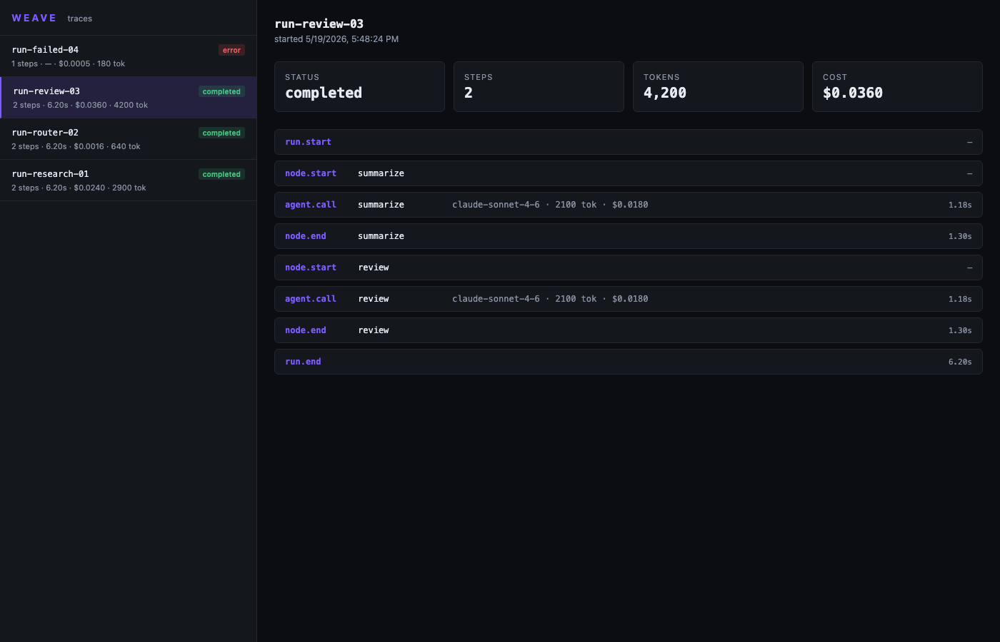

# weave

> TypeScript-native agent orchestrator. MCP-native. Observability built-in.

[](https://github.com/polymatx/weave/actions/workflows/ci.yml)
[](https://www.npmjs.com/package/@polymatx/weave)
[](https://www.npmjs.com/package/@polymatx/weave)
[](LICENSE)
[](https://www.typescriptlang.org/)




`weave` is a small, opinionated framework for building multi-agent workflows in TypeScript.

- **Type-safe graphs** — full TS inference across nodes
- **MCP-native** — plug any MCP server as tools, zero glue code
- **Observability built-in** — SQLite-backed tracer + local trace UI, no SaaS signup
- **Durable** — SQLite checkpoints, resume after crash
- **Cost guardrails** — per-run USD budget, kill switch
- **Multi-provider** — Anthropic, OpenAI, Google, Ollama via Vercel AI SDK

Docs: <https://polymatx.dev/weave/>

---

## Requirements

- **Node.js 22+** (native ESM, modern async APIs).
- A package manager that resolves peer dependencies (`pnpm`, `npm`, `yarn` all fine).

## Install

`@polymatx/weave` declares the Vercel AI SDK and provider packages as **peer dependencies**, so you install them alongside:

```bash
npm install @polymatx/weave @polymatx/weave-mcp ai @ai-sdk/anthropic
# or
pnpm add @polymatx/weave @polymatx/weave-mcp ai @ai-sdk/anthropic
# or
yarn add @polymatx/weave @polymatx/weave-mcp ai @ai-sdk/anthropic
```

Required peer versions: `ai@^6` and `@ai-sdk/anthropic@^3` (or any other `@ai-sdk/*` provider on the v3 spec).

For OpenAI / Google / Ollama instead of Anthropic, swap the provider package:

```bash
npm install @ai-sdk/openai     # v3+
npm install @ai-sdk/google     # v3+
npm install ollama-ai-provider # latest
```

## Quick start (60 seconds)

1. **Create a project** and install:

   ```bash
   mkdir hello-weave && cd hello-weave
   npm init -y
   npm install @polymatx/weave ai @ai-sdk/anthropic dotenv
   ```

2. **Set your API key** in a `.env` file (don't commit this — add `.env` to `.gitignore`):

   ```bash
   echo "ANTHROPIC_API_KEY=sk-ant-..." > .env
   echo ".env" >> .gitignore
   ```

3. **Save this as `app.mjs`:**

   ```js
   import 'dotenv/config';
   import { agent, graph, END, SqliteTracer } from '@polymatx/weave';
   import { anthropic } from '@ai-sdk/anthropic';

   const summarizer = agent({
     name: 'summarizer',
     model: anthropic('claude-haiku-4-5'),
     system: 'You write tight 2-sentence summaries. No fluff.',
   });

   const reviewer = agent({
     name: 'reviewer',
     model: anthropic('claude-haiku-4-5'),
     system: 'You critique writing in 1 sentence — call out the single weakest part.',
   });

   const tracer = new SqliteTracer('./weave.sqlite');

   const flow = graph()
     .node('summarize', summarizer.asNode(
       (s) => `Summarize: ${s.input}`,
       (r) => ({ summary: r.text }),
     ))
     .node('review', reviewer.asNode(
       (s) => `Critique this summary:\n${s.summary}`,
       (r) => ({ critique: r.text }),
     ))
     .edge('summarize', 'review')
     .edge('review', END)
     .compile();

   const result = await flow.run({
     initialState: { input: 'TypeScript is a superset of JavaScript with optional static typing.' },
     budgetUsd: 0.05,
     onEvent: (e) => tracer.record(e),
   });

   console.log('SUMMARY:', result.state.summary);
   console.log('CRITIQUE:', result.state.critique);
   console.log(`run=${result.runId}  ${result.durationMs}ms`);
   ```

4. **Run it:**

   ```bash
   node app.mjs
   ```

5. **Inspect the trace:**

   ```bash
   npx @polymatx/weave-ui --db ./weave.sqlite --port 4321
   # open http://localhost:4321
   ```

That's a real two-agent pipeline with persistence, cost tracking, and an audit trail — in 30 lines of code.

## Typed state in a graph

```ts
import { agent, graph, END } from '@polymatx/weave';
import { anthropic } from '@ai-sdk/anthropic';

interface State {
  topic: string;
  research: string;
  draft: string;
}

const researcher = agent({
  name: 'researcher',
  model: anthropic('claude-sonnet-4-6'),
  system: 'Research the topic. Return concise factual notes.',
});

const writer = agent({
  name: 'writer',
  model: anthropic('claude-sonnet-4-6'),
  system: 'Write a 200-word brief from the supplied notes.',
});

const flow = graph<State>()
  .node('research', researcher.asNode<State>(
    (s) => `Research: ${s.topic}`,
    (r) => ({ research: r.text }),
  ))
  .node('write', writer.asNode<State>(
    (s) => `Topic: ${s.topic}\n\nNotes:\n${s.research}`,
    (r) => ({ draft: r.text }),
  ))
  .edge('research', 'write')
  .edge('write', END)
  .compile();

const { state } = await flow.run({
  initialState: { topic: 'agent orchestration', research: '', draft: '' },
});
```

Every node sees and returns a typed slice of `State`. No `any`-laundering.

## MCP tools

Any MCP server (filesystem, GitHub, web-fetch, Postgres, …) plugs directly into an agent:

```ts
import { connectMcpServers } from '@polymatx/weave-mcp';
import { agent } from '@polymatx/weave';
import { anthropic } from '@ai-sdk/anthropic';

const mcp = await connectMcpServers({
  fetch:  { type: 'stdio', command: 'uvx', args: ['mcp-server-fetch'] },
  github: { type: 'stdio', command: 'npx', args: ['-y', '@modelcontextprotocol/server-github'] },
});

const researcher = agent({
  model: anthropic('claude-sonnet-4-6'),
  tools: mcp.tools, // <-- all MCP tools, namespaced as `<server>__<tool>`
});

// when you're done:
await mcp.closeAll();
```

JSON Schema → Zod conversion happens internally so the AI SDK's strict typing is preserved.

## Conditional edges (routing)

```ts
graph<State>()
  .node('classify', classifier)
  .node('billing', billingAgent.asNode(/* ... */))
  .node('support', supportAgent.asNode(/* ... */))
  .edge('classify', (s) => (s.intent === 'billing' ? 'billing' : 'support'))
  .edge('billing', END)
  .edge('support', END)
  .compile();
```

The edge target can be a string, `END`, or a function — sync or async — that inspects state and returns the next node name.

## Checkpoints & resume

For long-running flows where mid-run crashes shouldn't replay completed steps:

```ts
import { SqliteCheckpointStore } from '@polymatx/weave';

const checkpoints = new SqliteCheckpointStore('./weave.sqlite');

const flow = graph<State>()
  /* ...nodes/edges... */
  .checkpoint(checkpoints)
  .compile();

await flow.run({ initialState, runId: 'order-123' });

// later, after a crash:
await flow.run({ initialState, runId: 'order-123', resumeFromCheckpoint: true });
```

Each completed node appends a checkpoint row. Resuming loads the latest checkpoint, restores state, and continues from the recorded next node.

## Streaming

```ts
const a = agent({ model: anthropic('claude-sonnet-4-6'), system: '...' });

const { textStream, finalResult } = a.stream('Tell me a story.');
for await (const chunk of textStream) process.stdout.write(chunk);
const { usage } = await finalResult;
```

Inside a graph, use `streamAsNode()` — it emits `token.delta` events through the tracer.

## Budget guardrails

```ts
await flow.run({
  initialState,
  budgetUsd: 0.50, // hard cap on cumulative agent.call cost
  onEvent: (e) => tracer.record(e),
});
```

If the cumulative cost exceeds the budget, the run throws `BudgetExceededError` and stops. Useful for preventing runaway loops at 3 a.m.

## Trace UI

The dashboard reads from the same SQLite file your runs write to:

```bash
# one-off (recommended for standalone projects):
npx @polymatx/weave-ui --db ./weave.sqlite --port 4321

# or install globally:
npm install -g @polymatx/weave-ui
weave-ui --db ./weave.sqlite --port 4321
```

Shows: runs list, per-run timeline, model calls, tool calls, tokens, cost, errors.

## Packages

| Package                  | Description                                       |
| ------------------------ | ------------------------------------------------- |
| `@polymatx/weave`        | Core: `agent()`, `graph()`, checkpoints, tracer   |
| `@polymatx/weave-mcp`    | MCP client integration                            |
| `@polymatx/weave-ui`     | Local trace UI (CLI: `weave-ui`)                  |

## Examples

| Example          | What it shows                                              |
| ---------------- | ---------------------------------------------------------- |
| [`research-bot`](examples/research-bot)   | 2-agent linear flow + MCP web fetch + checkpoints + traces |
| [`code-reviewer`](examples/code-reviewer) | Single-agent pipeline reviewing `git diff` output          |
| [`chat-router`](examples/chat-router)    | Classifier + conditional edges → billing / support / sales |

To run any example from a clone of this repo:

```bash
git clone https://github.com/polymatx/weave && cd weave
pnpm install
pnpm build
echo "ANTHROPIC_API_KEY=sk-ant-..." > examples/chat-router/.env
pnpm --filter weave-example-chat-router start "my invoice looks wrong"
```

## Troubleshooting

**`UnsupportedModelVersionError: AI SDK 4 only supports models that implement specification version "v1".`**
You have an old `ai@4` in your dependency tree. weave 0.1+ requires `ai@^6`. Run:
```bash
npm install ai@^6 @ai-sdk/anthropic@^3
```

**`Could not locate the bindings file ... better_sqlite3.node`**
The native binding wasn't built. With `pnpm`, allow the build script:
```bash
pnpm approve-builds
# or in pnpm-workspace.yaml:
# allowBuilds:
#   better-sqlite3: true
```
With `npm` it should build automatically; if not, run `npm rebuild better-sqlite3`.

**`No projects matched the filters` when running `pnpm --filter @polymatx/weave-ui start`**
That command only works inside this monorepo. From a standalone consumer project use `npx @polymatx/weave-ui ...` instead.

**Costs show `$0.0000` in the tracer for a known model**
Your model ID didn't match any entry in [`pricing.ts`](packages/core/src/pricing.ts). Open a PR to add it — pricing data is in one file, updated by hand.

## Development (contributing)

```bash
git clone https://github.com/polymatx/weave && cd weave
pnpm install
pnpm typecheck
pnpm lint
pnpm test
pnpm build
```

See [CONTRIBUTING.md](CONTRIBUTING.md) for the workflow and style conventions.

## Why not LangGraph.js?

- **TS-first** — full type inference across graph state, no `any`-laundering.
- **MCP-native** — `mcp.tools` plugs into `agent({ tools })` directly. No adapter layer.
- **Observability bundled** — tracer + local dashboard in-repo. No SaaS dependency.
- **Smaller** — ~600 LOC core, no LangChain dep.

## License

MIT © polymatx
